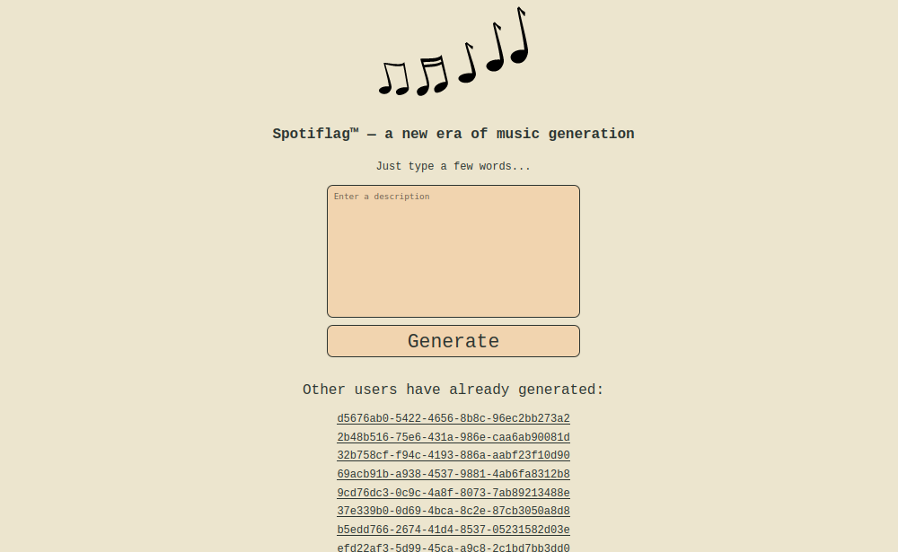
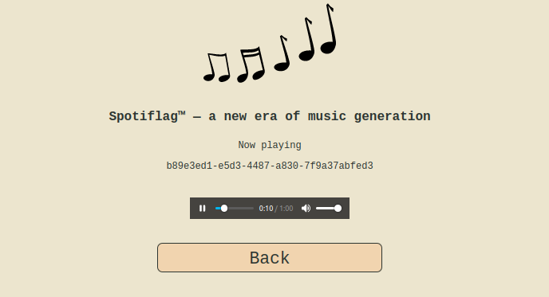
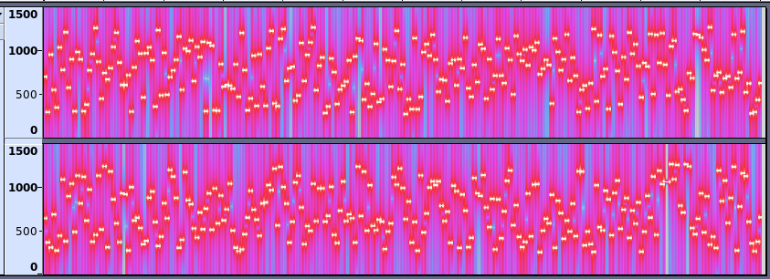

# RuCTF 2021 | Spotiflag

## Description

The service allows us to generate a song from the given text description.



When we entered some text and pressed `Generate` button, it starts to play the WAV file:



If we open the WAV in Audacity, we will see a lot of tones:



## Solution

While it was the web service, the main goal of the challenge is to reverse [spotiflag](../../services/spotiflag/spotiflag/spotiflag) binary, which was running as separate service.

The source code of the binary ([internal/spotiflag/](../../internal/spotiflag/)) was not given to the participants.

TLDR:

1. Recognize [Mersenne twister](https://en.wikipedia.org/wiki/Mersenne_Twister) pseudorandom generator.
2. Find out how to reverse MT state and retrieve the initial seed array.
3. Find out how to extract MT output from WAV file frequencies array.

First look at the file [src/main.c](../../internal/spotiflag/src/main.c). At the entry point it just starts the forking UNIX-socket server and waits for connections. On each connection it reads `description` text and construct the WAV file from it.

Look at the file [src/random.c](../../internal/spotiflag/src/random.c). It contains typical functions for MT:

```c
void random_init_by_value(random_t *random, random_element_t seed_value);
void random_init_by_array(random_t *random, random_element_t *seed_array, size_t seed_array_length);
void random_twist(random_t *random);
random_element_t random_temper(random_t *random, random_element_t value);
random_element_t random_next(random_t *random, size_t bits);
```

First the `description` parameter is passing to `random_init_by_array()` function and used as initial seed array of random generator. After the seeding we have internal `state` array of 32 128-bits elements. Also, we have `index` variable which is pointing to current `state` element, initially it's equal to 32.

`random_next()` function generates the integer of `bits` length. It uses `random_twist()` and `random_temper()` to shuffle `state` array and modify the output.

Each frequency of WAV file tones contains 10 bits of consecutive output of the generator. So, if one could extract sufficiently many frequencies from WAV file, then he can construct the original `state`, reverse the `random_init_by_array()` transformation and get the original `description`.

Example algorithm for MT seed recovering is described in [mt.py](mt.py).

## Fix

When one starts downloading the WAV file from server, he doesn't get the entire file at once. Instead, the server splits the WAV file to the chunks of 64 KB each.

The entire WAV file contains about 12 chunks, but checker in `CHECK` operation **always** downloads only 8 chunks.

So, it's easy to fix the service: just limit the downloading WAV file by 8 chunks.

## Exploit

Example sploit: [sploit.py](sploit.py)
